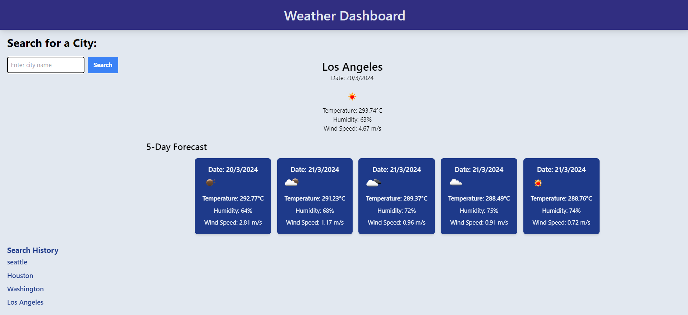

# Weather App

## Table of Contents

- [Description](#description)
- [Features](#features)
- [Technologies Used](#technologies-used)
- [Installation](#usage)
- [Usage](#usage)
- [License](#license)
- [Contributing](#contributing)

## Description

This Weather Dashboard focuses on creating a browser-based application that displays dynamically updated weather information for multiple cities. By utilizing the 5 Day Weather Forecast API from OpenWeatherMap, users can view current and future weather conditions, enabling them to plan trips accordingly. The application stores search history using localStorage to provide a seamless user experience.

## Features

- Search functionality for weather outlook in multiple cities
- Display of current and future weather conditions for searched cities
- Presentation of city name, date, weather icon, temperature, humidity, and wind speed
- 5-day forecast display with weather details
- Search history feature for easy access to previous city weather information

## Technologies Used

- CSS
- HTML
- JavaScript
- Tailwind
- OpenWeatherMap API
- Local Storage

## Installation
To install the Weather Dashboard, follow these steps:
1. Go to the `weather-app` directory.
2. Run `npm install`.
3. Run `npm run build` for tailwind.
4. Open the `index.html` file in your browser.

## Usage

To start working with the Weather Dashboard, follow these steps:
1. Register for a new API key with OpenWeatherMap.
2. Add the API key to the `apiKey` variable in the `script.js` file.
3. Open the `index.html` file in your browser.
4. Enter a city in the search bar and click the "Search" button.
5. The weather information will be displayed.

Experience the Weather Dashboard App by searching for cities and viewing their current and future weather conditions. Here is an image of how the Weather Dashboard looks like:  and the link to the deployed application is: [https://ThelmaRivas.github.io/weather-app/](https://ThelmaRivas.github.io/weather-app/) 

## License

This project is licensed under the MIT License. See the [LICENSE.md](./LICENSE) file for details.

## Contributing

Contributions are welcome, you can contact us for any suggestions or improvements.
